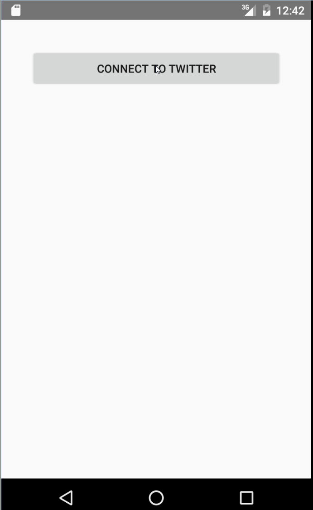

# Project 3 - TwitterClientForClass2

"SimpleTweets" is an android app that allows a user to view his Twitter timeline and post a new tweet. The app utilizes [Twitter REST API](https://dev.twitter.com/rest/public).

Time spent: 8 hours spent in total

## User Stories

The following **required** functionality is completed:

* [ X ]	User can **sign in to Twitter** using OAuth login
* [ X ]	User can **view tweets from their home timeline**
  * [ X ] User is displayed the username, name, and body for each tweet
* [ X ] User can **compose and post a new tweet**
  * [ X ] User can click a “Compose” icon in the Action Bar on the top right
  * [ X ] User can then enter a new tweet and post this to twitter
  * [ X ] User is taken back to home timeline

## Video Walkthrough 

Here's a walkthrough of implemented user stories:

GIF created with [LiceCap](http://www.cockos.com/licecap/).

## Notes

## Open-source libraries used

- [Android Async HTTP](https://github.com/loopj/android-async-http) - Simple asynchronous HTTP requests with JSON parsing
- [Picasso](http://square.github.io/picasso/) - Image loading and caching library for Android

## License

    Copyright 2015 Brian A. Miller

    Licensed under the Apache License, Version 2.0 (the "License");
    you may not use this file except in compliance with the License.
    You may obtain a copy of the License at

        http://www.apache.org/licenses/LICENSE-2.0

    Unless required by applicable law or agreed to in writing, software
    distributed under the License is distributed on an "AS IS" BASIS,
    WITHOUT WARRANTIES OR CONDITIONS OF ANY KIND, either express or implied.
    See the License for the specific language governing permissions and
    limitations under the License.
